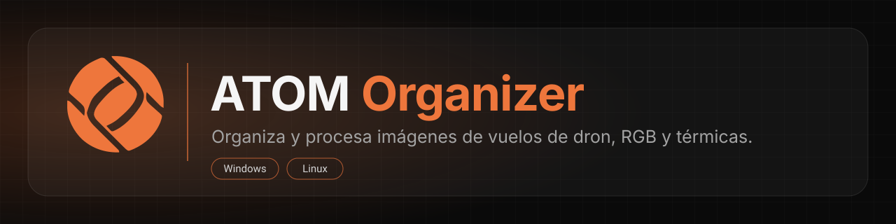

<picture>
  <source media="(prefers-color-scheme: dark)" srcset="docs/assets/banner-dark.svg">
  <source media="(prefers-color-scheme: light)" srcset="docs/assets/banner-light.svg">
  
</picture>

## Qué es

ATOM Organizer es una herramienta de escritorio de Aerotools que ordena las imágenes de vuelos de dron de inspección de plantas fotovoltaicas, tanto RGB como térmicas. Las agrupa por vuelo con ayuda de un estadillo (la hoja donde se registran los vuelos) y les da una nomenclatura homogénea, lista para su análisis.

> **Uso sujeto a licencia.** Para usar ATOM Organizer necesitas una licencia o cuenta autorizada por Aerotools. El código visible en este repositorio no concede ningún derecho de uso. Contacto: ver [Soporte](#soporte).

## Descarga

[**Descargar para Windows**](https://github.com/saezro/atom-organizer/releases/latest) &nbsp;·&nbsp; [**Descargar para Linux**](https://github.com/saezro/atom-organizer/releases/latest)

En la página de la última versión encontrarás, dentro de *Assets*:

| Sistema | Archivo | Cómo instalarlo |
| --- | --- | --- |
| Windows | `ATOM-Organizer-Setup-vX.Y.Z.exe` | Ejecuta el instalador y sigue los pasos. No requiere permisos de administrador. |
| Linux | `ATOM_Organizer-vX.Y.Z-x86_64.AppImage` | Dale permisos de ejecución (`chmod +x`) y ábrelo con doble clic. |

La aplicación te avisa cuando hay una versión nueva.

## Cómo entrar

Al abrir la aplicación, inicia sesión de una de estas dos formas:

- **Usuario y contraseña** de la plataforma de Aerotools.
- **Entrar con Google**, con la cuenta asociada a tu acceso.

Las credenciales las proporciona Aerotools. Sin ellas no se puede usar la aplicación. Si no tienes acceso, solicítalo a tu contacto en Aerotools.

## Requisitos

- **Windows:** 10 o 11, 64 bits.
- **Linux:** distribución de 64 bits (x86_64) con soporte para AppImage.
- Conexión a internet para iniciar sesión y comprobar actualizaciones.
- Espacio libre en disco suficiente para las copias de tus vuelos.

### Estadillo de vuelos

Necesitas un estadillo con una fila por vuelo. Puede ser un CSV separado por `;` o un Excel (`.xlsx` o `.xls`).

Columnas obligatorias:

| Columna | Qué contiene |
| --- | --- |
| `PB` | Número del Power Block (PB), el bloque de potencia de la planta que se sobrevuela |
| `Vuelo` | Número de vuelo |
| `Fecha` | Fecha del vuelo |
| `Hora_de_inicio` | Hora de inicio |
| `Hora_final` | Hora de fin |

Los ficheros a los que les falte alguna de estas columnas se descartan.

Columnas opcionales: `Empresa`, `Trabajo`, `Piloto`, `Equipo_de_vuelo`, `Pitch`, `Alt_vuelo`, `Vel_vuelo`, `Termica` y `RGB`.

Las cabeceras pueden estar en español o en inglés.

El nombre del archivo es libre. La aplicación lo detecta sola en la carpeta de origen, incluidas sus subcarpetas hasta 2 niveles, e ignora los archivos ocultos y los temporales de Office (`~$`). Si hay varios estadillos, los fusiona. También puede llegar desde la app Estadillo Digital por red local.

### Imágenes

- **Térmicas:** nombre con sufijo `_T`.
- **RGB:** sufijo `_W`, `_Z` o `_V`, o sin sufijo.
- **Cámaras DJI compatibles:** M3T, M30T, M4T, H20T y H30T.

Cada imagen se asigna a su vuelo comparando su hora con la del estadillo. El resultado se organiza en carpetas `PB<pb>_V<vuelo>`.

## Preguntas frecuentes

**¿Modifica mis imágenes originales?**
*Procesado RGB* trabaja siempre sobre copias y nunca toca el origen. Las opciones de *Extracción TMC* y *Convertir DJI a TIFF* mueven o eliminan archivos en la carpeta de origen: en material irreemplazable, trabaja sobre una copia del vuelo.

**¿Funciona el procesado térmico en Linux?**
Parcialmente. La conversión radiométrica DJI a TIFF y la extracción de archivos `.TMC` dependen de componentes solo disponibles en Windows. Para el flujo térmico completo, usa la versión de Windows. El resto de funciones son iguales en ambos sistemas.

**Windows me muestra un aviso al instalar.**
Es el aviso habitual de SmartScreen para aplicaciones nuevas. Elige *Más información* y después *Ejecutar de todos modos*.

**¿Cómo actualizo?**
La aplicación te lo propone al detectar una versión nueva. También puedes descargar el instalador más reciente desde [Releases](https://github.com/saezro/atom-organizer/releases/latest) e instalarlo encima.

## Soporte

Si ya tienes acceso y algo no funciona, o tienes una sugerencia, abre una incidencia en [GitHub Issues](https://github.com/saezro/atom-organizer/issues) indicando tu sistema operativo, la versión de la aplicación y qué estabas haciendo. No adjuntes datos de clientes ni credenciales.

Para solicitar una licencia o acceso, escribe a tu contacto habitual en Aerotools.

---

Documentación para desarrolladores: [docs/DESARROLLO.md](docs/DESARROLLO.md)

## Licencia

Software propietario. © 2026 Aerotools. Todos los derechos reservados. Ver [LICENSE](LICENSE).
